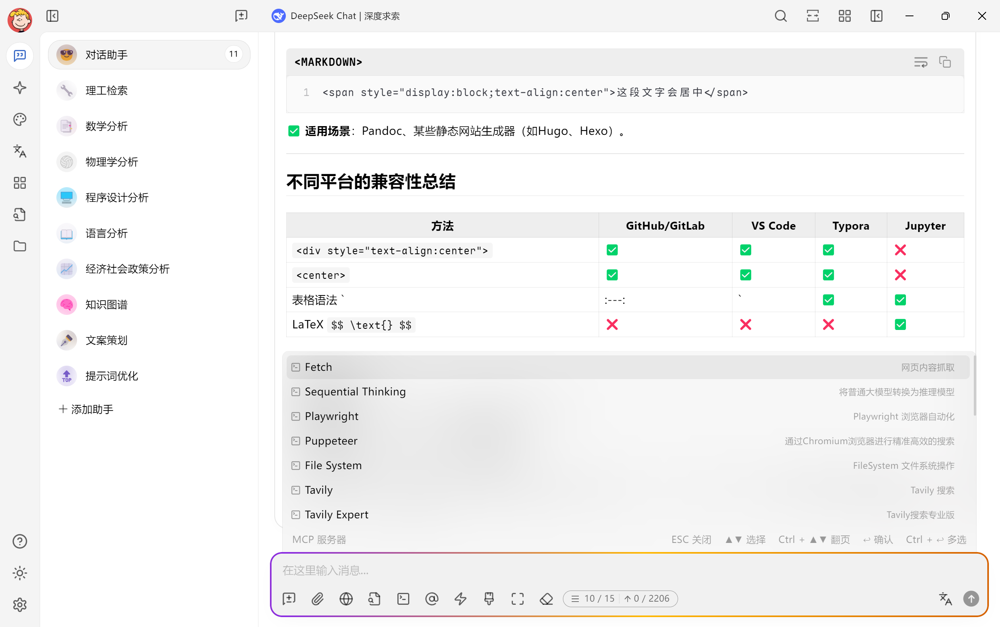
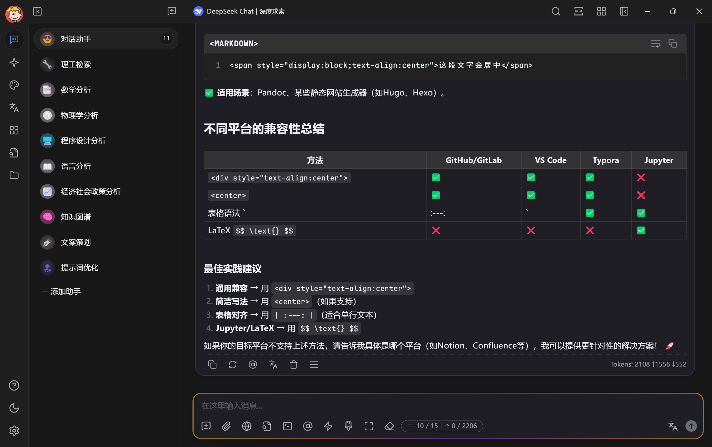

# Maple Neon : Un thème pour Cherry Studio


<div style="text-align: center">
<a href="https://github.com/BoningtonChen/CherryStudio_themes/blob/master/docs/README.zh.md">中文</a> |
<a href="https://github.com/BoningtonChen/CherryStudio_themes/blob/master/README.md">English</a> |
Français |
<a href="https://github.com/BoningtonChen/CherryStudio_themes/blob/master/docs/README.ja.md">日本語</a>
</div>

## Introduction

Ceci est un thème conçu pour Cherry Studio, un client de bureau qui prend en charge plusieurs fournisseurs de modèles de langage (LLM) et est disponible sur Windows, Mac et Linux. \
Pour plus d'informations sur Cherry Studio, consultez [ici](https://github.com/CherryHQ/cherry-studio).

## Comment utiliser

1. (Recommandé mais pas obligatoire) Téléchargez [Maple Font](https://github.com/subframe7536/maple-font/releases/download/v7.3/MapleMono-NF-CN-unhinted.zip). Si vous n'aimez pas la police d'écriture, la police de secours par défaut devrait être celle de `Fira Code`.
2. (Recommandé mais pas obligatoire) Téléchargez Harmony OS Sans depuis [Harmony OS Sans](https://developer.huawei.com/images/download/general/HarmonyOS-Sans.zip). Si vous n'aimez pas la police d'écriture, la police de secours par défaut devrait être celle de l'interface utilisateur de votre système.
3. Copiez le contenu du fichier [maple-neon.css](../themes/maple-neon.css) (pour la version d'origine) ou téléchargez le fichier brut (pour la personnalisation).
4. Colliez-le dans Cherry Studio.
5. Et voilà !

<details>
<summary>Ou copiez le CSS depuis ici !</summary>

```css
/* Maple Neon Minimal Theme for Cherry Studio
   专注于输入框AI智能体运行时的跑马灯效果 */

/* === 字体设置 === */
:root {
    --font-family:
        var(--user-font-family), "Microsoft YaHei", "微软雅黑", Ubuntu,
        -apple-system, BlinkMacSystemFont, "Segoe UI", system-ui, Roboto,
        Oxygen, Cantarell, "Open Sans", "Helvetica Neue", Arial, "Noto Sans",
        sans-serif, "Apple Color Emoji", "Segoe UI Emoji", "Segoe UI Symbol",
        "Noto Color Emoji";

    --font-family-serif:
        "Microsoft YaHei", "微软雅黑", serif, -apple-system, BlinkMacSystemFont,
        "Segoe UI", system-ui, Ubuntu, Roboto, Oxygen, Cantarell, "Open Sans",
        "Helvetica Neue", Arial, "Noto Sans", "Apple Color Emoji",
        "Segoe UI Emoji", "Segoe UI Symbol", "Noto Color Emoji";

    --code-font-family:
        var(--user-code-font-family), "Maple Mono", "Cascadia Code",
        "Fira Code", "Consolas", "Sarasa Mono SC", "Microsoft YaHei UI",
        "微软雅黑", Menlo, Courier, monospace;
}

/* Windows系统专用字体配置 */
body[os="windows"] {
    --font-family:
        var(--user-font-family), "Microsoft YaHei", "微软雅黑",
        "Twemoji Country Flags", Ubuntu, -apple-system, BlinkMacSystemFont,
        "Segoe UI", system-ui, Roboto, Oxygen, Cantarell, "Open Sans",
        "Helvetica Neue", Arial, "Noto Sans", sans-serif, "Apple Color Emoji",
        "Segoe UI Emoji", "Segoe UI Symbol", "Noto Color Emoji";

    --code-font-family:
        var(--user-code-font-family), "Maple Mono", "Cascadia Code",
        "Fira Code", "Consolas", "Sarasa Mono SC", "Microsoft YaHei UI",
        "微软雅黑", Courier, monospace;
}

/* === Markdown字体配置 === */
/* 标题字体 - 使用梦源黑体，层次分明 */
.markdown h1,
.markdown h2,
.markdown h3,
.markdown h4,
.markdown h5,
.markdown h6 {
    font-family: "DreamHan Sans", "梦源黑体", var(--font-family);
    font-weight: 600;
    letter-spacing: 0.02em;
}

/* H1和H2使用更粗的字重，突出重要性 */
.markdown h1,
.markdown h2 {
    font-weight: 700;
    letter-spacing: 0.01em;
}

/* 正文内容 - 使用梦源宋体，提升阅读体验，排除代码元素 */
.markdown p:not(pre p),
.markdown li:not(pre li),
.markdown span:not(code):not(pre span):not(.shiki span) {
    font-family: "DreamHan Serif", "梦源宋体", var(--font-family);
    line-height: 1.7;
    letter-spacing: 0.01em;
}

/* 引用块 - 使用梦源宋体斜体，增强视觉区分 */
.markdown blockquote,
.markdown .markdown-alert {
    font-family: "DreamHan Serif", "梦源宋体", var(--font-family);
    font-style: italic;
    line-height: 1.6;
    letter-spacing: 0.015em;
}

/* 表格 - 使用梦源黑体，保证数据清晰 */
.markdown table,
.markdown th,
.markdown td {
    font-family: "DreamHan Sans", "梦源黑体", var(--font-family);
}

.markdown th {
    font-weight: 600;
    letter-spacing: 0.02em;
}

.markdown td {
    font-weight: 400;
    letter-spacing: 0.01em;
}

/* 强调文本 */
.markdown strong {
    font-family: "DreamHan Sans", "梦源黑体", var(--font-family);
    font-weight: 700;
}

.markdown em {
    font-family: "DreamHan Serif", "梦源宋体", var(--font-family);
    font-style: italic;
}

/* 链接 */
.markdown a,
.markdown .link {
    font-family: "DreamHan Sans", "梦源黑体", var(--font-family);
    font-weight: 500;
}

/* 脚注 */
.footnotes {
    font-family: "DreamHan Serif", "梦源宋体", var(--font-family);
    font-size: 0.9em;
    line-height: 1.5;
}

/* 代码字体 - 最高优先级确保Maple Mono */
.markdown code,
.markdown pre,
.markdown pre *,
.markdown pre code,
.markdown code *,
code,
pre,
pre *,
*[class*="code"] {
    font-family: var(--code-font-family) !important;
}

/* 内联代码 - 确保在任何容器中都使用Maple Mono */
.markdown p code,
.markdown li code,
.markdown span code,
.markdown div code,
.markdown blockquote code,
.markdown .markdown-alert code,
.markdown table code,
.markdown th code,
.markdown td code,
.markdown h1 code,
.markdown h2 code,
.markdown h3 code,
.markdown h4 code,
.markdown h5 code,
.markdown h6 code,
.markdown strong code,
.markdown em code,
.markdown a code {
    font-family: var(--code-font-family) !important;
    font-weight: normal !important;
    font-style: normal !important;
    letter-spacing: 0 !important;
}

/* === AI智能体跑马灯动画 === */
@keyframes ai-running-gradient {
    0% {
        background-position: 0% 50%;
    }
    25% {
        background-position: 100% 50%;
    }
    50% {
        background-position: 200% 50%;
    }
    75% {
        background-position: 300% 50%;
    }
    100% {
        background-position: 400% 50%;
    }
}

/* AI思考状态脉冲 */
@keyframes ai-thinking-pulse {
    0%,
    100% {
        box-shadow: 0 0 5px rgba(255, 106, 1, 0.2);
    }
    50% {
        box-shadow: 0 0 20px rgba(138, 43, 226, 0.6);
    }
}

/* 数据流动效果 */
@keyframes ai-data-flow {
    0% {
        transform: translateX(-100%);
        opacity: 0;
    }
    50% {
        opacity: 1;
    }
    100% {
        transform: translateX(100%);
        opacity: 0;
    }
}

/* === 输入框跑马灯效果 === */
#inputbar {
    position: relative;
    border-radius: 12px;
}

/* AI运行时的跑马灯边框 */
#inputbar::before {
    content: "";
    position: absolute;
    inset: -2px;
    border-radius: inherit;
    padding: 2px;
    background: linear-gradient(
        90deg,
        #ff6a01,
        /* 爱马仕橙 */ #f8c91c,
        /* 那不勒斯黄 */ #8a2be2,
        /* 紫罗兰 */ #00d4ff,
        /* 青色 */ #f8c91c,
        /* 那不勒斯黄 */ #ff6a01 /* 爱马仕橙 */
    );
    background-size: 300% 100%;
    mask:
        linear-gradient(#fff 0 0) content-box,
        linear-gradient(#fff 0 0);
    -webkit-mask:
        linear-gradient(#fff 0 0) content-box,
        linear-gradient(#fff 0 0);
    -webkit-mask-composite: destination-out;
    mask-composite: exclude;
    animation: ai-running-gradient 7s linear infinite;
    opacity: 0;
    transition: opacity 0.4s ease-in-out;
    pointer-events: none;
    z-index: -1;
}

/* 激活跑马灯效果的条件 */
#inputbar:focus-within::before,
#inputbar.ai-active::before,
#inputbar[data-ai-status="running"]::before {
    opacity: 1;
}

/* AI思考状态的额外效果 */
#inputbar.ai-thinking {
    animation: ai-thinking-pulse 4s ease-in-out infinite;
}

/* 数据流动覆盖层 */
#inputbar.ai-thinking::after {
    content: "";
    position: absolute;
    top: 0;
    left: -100%;
    width: 100%;
    height: 100%;
    background: linear-gradient(
        90deg,
        transparent,
        rgba(0, 212, 255, 0.1),
        transparent
    );
    animation: ai-data-flow 3.5s ease-in-out infinite;
    border-radius: inherit;
    pointer-events: none;
    z-index: 1;
}

/* === 输入框内部样式优化 === */
#inputbar input,
#inputbar textarea {
    position: relative;
    z-index: 2;
    transition: all 0.3s ease;
}

/* === 状态指示器 === */
.ai-status-dot {
    position: absolute;
    top: 8px;
    right: 8px;
    width: 6px;
    height: 6px;
    border-radius: 50%;
    background: #8a2be2;
    opacity: 0;
    transition: opacity 0.3s ease;
    z-index: 3;
}

#inputbar.ai-thinking .ai-status-dot,
#inputbar[data-ai-status="running"] .ai-status-dot {
    opacity: 1;
    animation: ai-thinking-pulse 3s ease-in-out infinite;
}

/* === 辅助类 === */
/* 手动触发AI运行效果 */
.ai-mode-active #inputbar::before {
    opacity: 1 !important;
}

/* 禁用AI效果 */
.ai-mode-disabled #inputbar::before,
.ai-mode-disabled #inputbar::after {
    opacity: 0 !important;
    animation: none !important;
}

/* === 响应式设计 === */
@media (max-width: 768px) {
    #inputbar::before {
        inset: -1px;
        padding: 1px;
    }

    #inputbar::before {
        background-size: 200% 100%;
        animation-duration: 5.5s;
    }
}

/* === 无障碍支持 === */
@media (prefers-reduced-motion: reduce) {
    #inputbar::before,
    #inputbar::after,
    #inputbar,
    .ai-status-dot {
        animation: none !important;
    }

    #inputbar::before {
        background: linear-gradient(90deg, #ff6a01, #8a2be2);
        background-size: 100% 100%;
    }
}

/* === 高对比度模式 === */
@media (prefers-contrast: high) {
    #inputbar::before {
        background: linear-gradient(
            90deg,
            #ff8c00,
            #ffd700,
            #9370db,
            #00bfff,
            #ffd700,
            #ff8c00
        );
    }
}

/* === 浏览器兼容性修复 === */
/* Firefox支持 */
@supports not (-webkit-mask-composite: destination-out) {
    #inputbar::before {
        mask-composite: exclude;
    }
}

/* Safari支持 */
@supports (-webkit-mask-composite: destination-out) {
    #inputbar::before {
        -webkit-mask-composite: destination-out;
    }
}
```

</details>

## Qu'est-ce qui rend le thème spécial ?

- Il propose une interface utilisateur modernisée et esthétique pour Cherry Studio.
- Il mêle la police Maple à une zone de saisie au style néon, créant une expérience unique et visuellement attractive.

## Exposition

Basé sur Cherry Studio v1.2.4




## Personnalisation

Vous pouvez forker le projet et modifier votre propre thème pour Cherry Studio. Pour les instructions détaillées, consultez [Documentation Cherry Studio](https://docs.cherry-ai.com/personalization-settings/css).

## Un dernier coup d'œil

Pour d'autres thèmes, consultez [Un dernier coup d'œil](../OneMoreGlance.md)

## Inspirations

### Thèmes

- Thème Dracula : <https://cherrycss.com>
- Thème Neon : <https://cherry-ai.com/css>

### Polices

- Police Maple : <https://github.com/subframe7536/maple-font>
- Police HarmonyOS: <https://developer.huawei.com/consumer/cn/design/resource/>

### Outils  

- Les Thèmes sont construits partiellement avec l'aide de DeepSeek-0324 & Claude-3.7.

## LICENCE

Le projet suit la [Licence MIT](../LICENSE).
