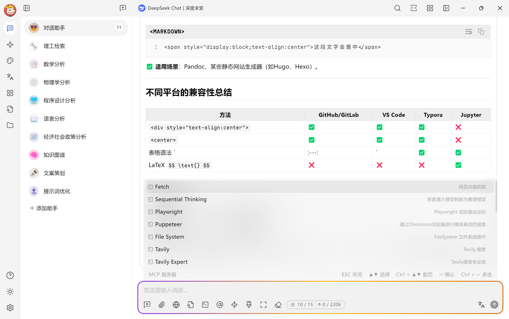
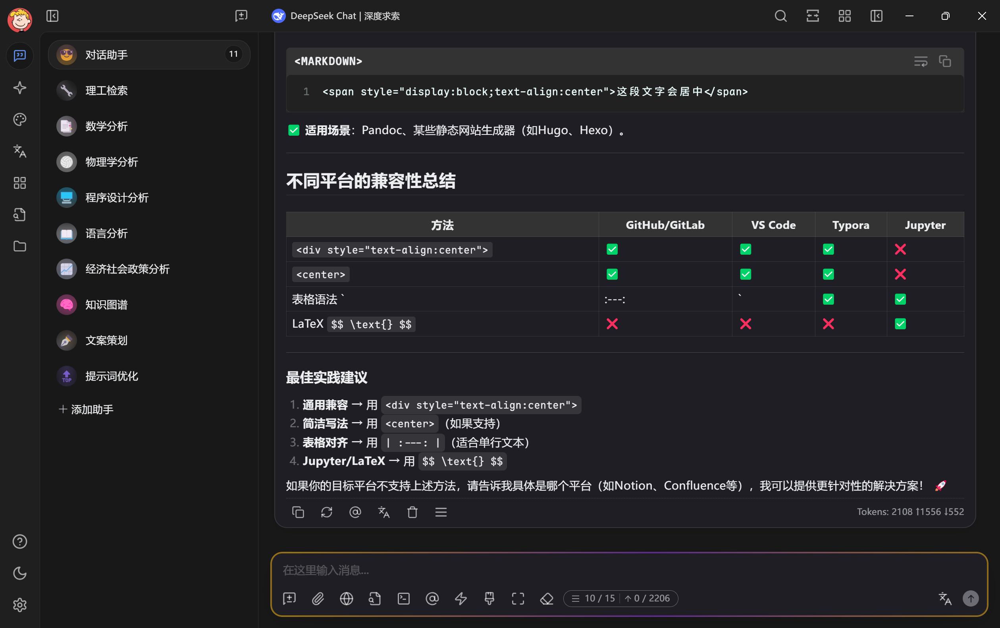

# Maple Neon：Cherry Studio 主题


<div style="text-align: center">
中文 |
<a href="https://github.com/BoningtonChen/CherryStudio_themes/blob/master/README.md">English</a> |
<a href="https://github.com/BoningtonChen/CherryStudio_themes/blob/master/docs/README.fr.md">Français</a> |
<a href="https://github.com/BoningtonChen/CherryStudio_themes/blob/master/docs/README.ja.md">日本語</a>
</div>

## 介绍

这是一款为Cherry Studio量身定制的主题，Cherry Studio是一款支持多个大语言模型供应商的桌面客户端，可在Windows、Mac和Linux系统上使用。\
如需了解更多关于Cherry Studio的信息，请查看[此处](https://github.com/CherryHQ/cherry-studio)。

## 使用方法

1. （推荐但非必需）从 [Maple Font](https://github.com/subframe7536/maple-font/releases/download/v7.3/MapleMono-NF-CN-unhinted.zip) 下载Maple Mono NF CN。如果你不喜欢该字体，默认的备用字体应为`Fira Code`。
2. （推荐但非必需）从 [梦源字体](https://github.com/Pal3love/dream-han-cjk/releases) 下载梦源黑体和梦源宋体。如果你不喜欢该字体，系统将使用微软雅黑作为备用字体。
3. 复制 [maple-neon.css](../themes/maple-neon.css) 文件（原始版本）中的内容，或下载原始文件（用于定制）。
4. 将其粘贴到 Cherry Studio 中。
5. 完成！

<details>
<summary>或者，如果你不想修改，直接从这里复制CSS！</summary>

```css
/* Maple Neon Minimal Theme for Cherry Studio
   专注于输入框AI智能体运行时的跑马灯效果 */

/* === 字体配置 === */
:root {
    /* UI字体：使用微软雅黑作为主要UI字体 */
    --font-family:
        var(--user-font-family), "Microsoft YaHei", "Microsoft YaHei UI",
        "微软雅黑", Ubuntu, -apple-system, BlinkMacSystemFont, "Segoe UI",
        system-ui, Roboto, Oxygen, Cantarell, "Open Sans", "Helvetica Neue",
        Arial, "Noto Sans", sans-serif, "Apple Color Emoji", "Segoe UI Emoji",
        "Segoe UI Symbol", "Noto Color Emoji";

    /* 代码字体：使用Maple Mono作为代码字体 */
    --code-font-family:
        var(--user-code-font-family), "Maple Mono", "Maple Mono NF",
        "Cascadia Code", "Fira Code", "Consolas", Menlo, Courier, monospace;
}

/* Windows系统专用字体配置 */
body[os="windows"] {
    --font-family:
        var(--user-font-family), "Microsoft YaHei", "Microsoft YaHei UI",
        "微软雅黑", "Twemoji Country Flags", Ubuntu, -apple-system,
        BlinkMacSystemFont, "Segoe UI", system-ui, Roboto, Oxygen, Cantarell,
        "Open Sans", "Helvetica Neue", Arial, "Noto Sans", sans-serif,
        "Apple Color Emoji", "Segoe UI Emoji", "Segoe UI Symbol",
        "Noto Color Emoji";

    --code-font-family:
        var(--user-code-font-family), "Maple Mono", "Maple Mono NF",
        "Cascadia Code", "Fira Code", "Consolas", "Sarasa Mono SC",
        "Microsoft YaHei UI", Courier, monospace;
}

/* 应用字体到具体元素 */
body {
    font-family: var(--font-family);
}

/* 代码相关元素使用Maple Mono字体 */
code,
pre,
.markdown code,
.markdown pre,
.shiki,
.cm-editor .cm-scroller,
kbd,
samp,
tt,
var {
    font-family: var(--code-font-family) !important;
}

/* === AI智能体跑马灯动画 === */
@keyframes ai-running-gradient {
    0% {
        background-position: 0% 50%;
    }
    25% {
        background-position: 100% 50%;
    }
    50% {
        background-position: 200% 50%;
    }
    75% {
        background-position: 300% 50%;
    }
    100% {
        background-position: 400% 50%;
    }
}

/* AI思考状态脉冲 */
@keyframes ai-thinking-pulse {
    0%,
    100% {
        box-shadow: 0 0 5px rgba(255, 106, 1, 0.2);
    }
    50% {
        box-shadow: 0 0 20px rgba(138, 43, 226, 0.6);
    }
}

/* 数据流动效果 */
@keyframes ai-data-flow {
    0% {
        transform: translateX(-100%);
        opacity: 0;
    }
    50% {
        opacity: 1;
    }
    100% {
        transform: translateX(100%);
        opacity: 0;
    }
}

/* === 输入框跑马灯效果 === */
#inputbar {
    position: relative;
    border-radius: 12px;
}

/* AI运行时的跑马灯边框 */
#inputbar::before {
    content: "";
    position: absolute;
    inset: -2px;
    border-radius: inherit;
    padding: 2px;
    background: linear-gradient(
        90deg,
        #ff6a01,
        /* 爱马仕橙 */ #f8c91c,
        /* 那不勒斯黄 */ #8a2be2,
        /* 紫罗兰 */ #00d4ff,
        /* 青色 */ #f8c91c,
        /* 那不勒斯黄 */ #ff6a01 /* 爱马仕橙 */
    );
    background-size: 300% 100%;
    mask:
        linear-gradient(#fff 0 0) content-box,
        linear-gradient(#fff 0 0);
    -webkit-mask:
        linear-gradient(#fff 0 0) content-box,
        linear-gradient(#fff 0 0);
    -webkit-mask-composite: destination-out;
    mask-composite: exclude;
    animation: ai-running-gradient 7s linear infinite;
    opacity: 0;
    transition: opacity 0.4s ease-in-out;
    pointer-events: none;
    z-index: -1;
}

/* 激活跑马灯效果的条件 */
#inputbar:focus-within::before,
#inputbar.ai-active::before,
#inputbar[data-ai-status="running"]::before {
    opacity: 1;
}

/* AI思考状态的额外效果 */
#inputbar.ai-thinking {
    animation: ai-thinking-pulse 4s ease-in-out infinite;
}

/* 数据流动覆盖层 */
#inputbar.ai-thinking::after {
    content: "";
    position: absolute;
    top: 0;
    left: -100%;
    width: 100%;
    height: 100%;
    background: linear-gradient(
        90deg,
        transparent,
        rgba(0, 212, 255, 0.1),
        transparent
    );
    animation: ai-data-flow 3.5s ease-in-out infinite;
    border-radius: inherit;
    pointer-events: none;
    z-index: 1;
}

/* === 输入框内部样式优化 === */
#inputbar input,
#inputbar textarea {
    position: relative;
    z-index: 2;
    transition: all 0.3s ease;
}

/* === 状态指示器 === */
.ai-status-dot {
    position: absolute;
    top: 8px;
    right: 8px;
    width: 6px;
    height: 6px;
    border-radius: 50%;
    background: #8a2be2;
    opacity: 0;
    transition: opacity 0.3s ease;
    z-index: 3;
}

#inputbar.ai-thinking .ai-status-dot,
#inputbar[data-ai-status="running"] .ai-status-dot {
    opacity: 1;
    animation: ai-thinking-pulse 3s ease-in-out infinite;
}

/* === 辅助类 === */
/* 手动触发AI运行效果 */
.ai-mode-active #inputbar::before {
    opacity: 1 !important;
}

/* 禁用AI效果 */
.ai-mode-disabled #inputbar::before,
.ai-mode-disabled #inputbar::after {
    opacity: 0 !important;
    animation: none !important;
}

/* === 响应式设计 === */
@media (max-width: 768px) {
    #inputbar::before {
        inset: -1px;
        padding: 1px;
    }

    #inputbar::before {
        background-size: 200% 100%;
        animation-duration: 5.5s;
    }
}

/* === 无障碍支持 === */
@media (prefers-reduced-motion: reduce) {
    #inputbar::before,
    #inputbar::after,
    #inputbar,
    .ai-status-dot {
        animation: none !important;
    }

    #inputbar::before {
        background: linear-gradient(90deg, #ff6a01, #8a2be2);
        background-size: 100% 100%;
    }
}

/* === 高对比度模式 === */
@media (prefers-contrast: high) {
    #inputbar::before {
        background: linear-gradient(
            90deg,
            #ff8c00,
            #ffd700,
            #9370db,
            #00bfff,
            #ffd700,
            #ff8c00
        );
    }
}

/* === 浏览器兼容性修复 === */
/* Firefox支持 */
@supports not (-webkit-mask-composite: destination-out) {
    #inputbar::before {
        mask-composite: exclude;
    }
}

/* Safari支持 */
@supports (-webkit-mask-composite: destination-out) {
    #inputbar::before {
        -webkit-mask-composite: destination-out;
    }
}
```

</details>

## 特别之处

- 为Cherry Studio提供现代且美观的用户界面。
- 将Maple字体与霓虹风格的输入栏相结合，打造独特且视觉效果出众的使用体验。
- 使用梦源字体系列和微软雅黑提供优质的中文字体显示效果。

## 展示

基于Cherry Studio v1.2.4




## 自定义

您可以 fork 该项目并修改自己的 Cherry Studio 主题，具体说明请查看 [Cherry Studio 文档](https://docs.cherry-ai.com/personalization-settings/css)。

## 多看一眼

如需查看其他主题，请查阅[多看一眼](../OneMoreGlance.md)

## 灵感来源

### 主题

- Dracula Theme: <https://cherrycss.com>
- Neon Theme: <https://cherry-ai.com/css>

### 字体

- Maple Font: <https://github.com/subframe7536/maple-font>
- DreamHan Sans: <https://github.com/Pal3love/dream-han-cjk/releases>

### 工具

- 主题部分是在DeepSeek-0324和Claude-3.7的帮助下构建的。

## LICENSE

本项目遵循 [MIT LICENSE](../LICENSE)。
